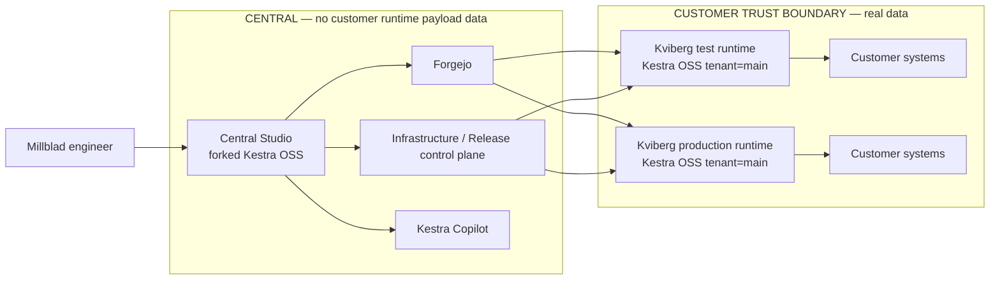
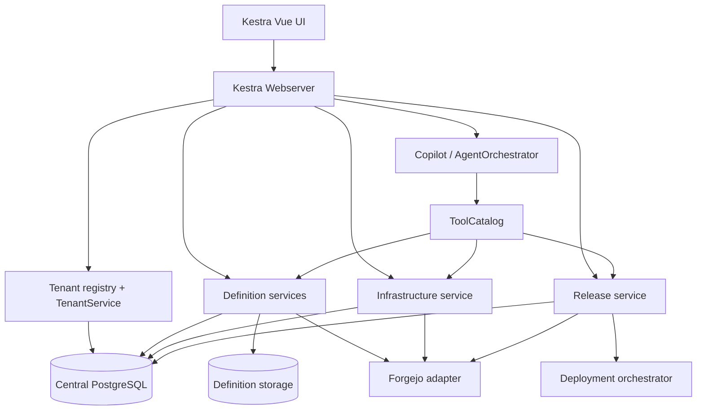
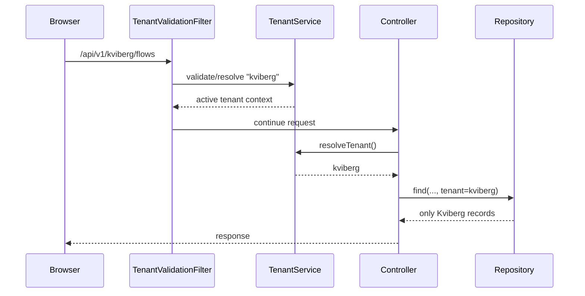
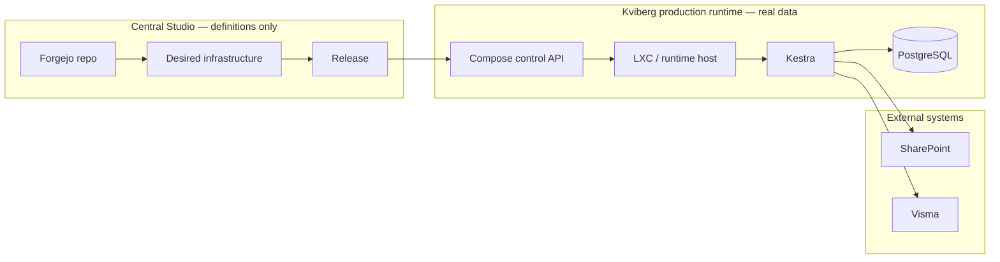
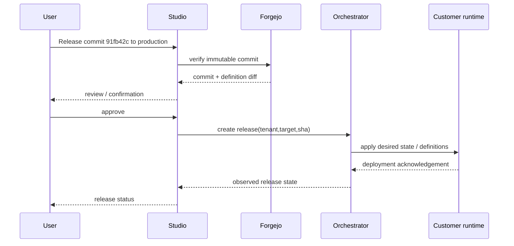
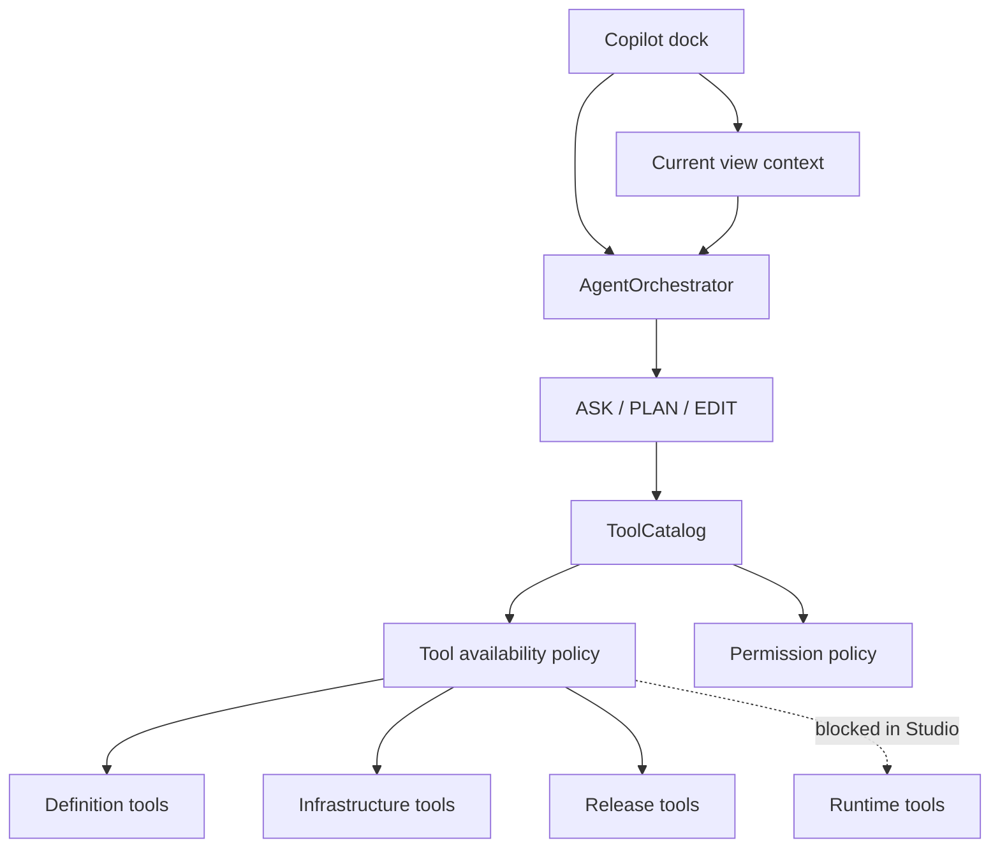

# Millblad Central Studio — target architecture

Status: proposed target architecture  
Repository: `cafaroo/kestra`  
Architecture style: central definition/control plane + isolated single-tenant runtimes

## 1. Purpose

Millblad Central Studio is the engineering and control plane for customer automation.

It owns:

- tenant/customer identity;
- workflow and namespace definitions;
- infrastructure desired state;
- release targets and release metadata;
- Git/source-of-truth integration;
- AI-assisted authoring, analysis and release operations.

It does **not** become the operational runtime for customer workloads.

The core invariant is:

> Central Studio may know how a customer environment is defined and what is deployed, but it does not hold the customer's operational payload data.

## 2. Canonical domain model

The following mapping is architectural, not merely UI terminology:

| Concept | Meaning |
| --- | --- |
| Tenant | Customer in Central Studio |
| Namespace | Business/workflow domain inside one tenant |
| Release target | Deployable environment such as test or production |
| Runtime | Isolated Kestra instance belonging to exactly one customer target |
| Runtime tenant | `main` inside the customer runtime |
| Git repository | Source of truth for the customer's definitions |
| Release | Immutable source commit applied to one release target |

Example:

```text
tenant: kviberg

namespaces:
  painting.*
  finance.*
  project.*
  discovery.*

release targets:
  test
  production

runtime instances:
  kviberg-test       tenant=main
  kviberg-production tenant=main
```

A release target is never encoded as a tenant or namespace.

## 3. System context



Forgejo and the control plane are central services, but customer repositories and credentials must still be access-isolated per tenant.

## 4. Central Studio internal architecture



### Central Studio process profile

Definition-only Studio should run:

- Webserver/API;
- UI;
- repositories required for definitions and Studio metadata;
- AI/Copilot;
- indexer only where required by definition/search surfaces.

It should not run customer workload execution components:

- no Worker;
- no customer Scheduler;
- no customer Executor;
- no customer Worker Controller.

Any Kestra runtime entrypoint still reachable through Webserver must additionally be blocked by Studio-mode policy.

## 5. Tenant architecture

Kestra OSS already carries tenant identity throughout much of the stack.

Existing foundations include:

- `TenantService`;
- `TenantInterface`;
- tenant-aware flow/execution/trigger IDs;
- `tenant_id` columns and indexes;
- tenant-aware repository filters;
- tenant-aware internal storage;
- tenant-aware agent threads/tools;
- `/:tenant` UI routes;
- `/api/v1/{tenant}` controller routes.

Millblad should therefore activate and harden the existing tenant seam rather than introduce a parallel tenancy abstraction.

### Request flow



The tenant comes from the authenticated/request scope, not from request payload data.

## 6. Definition architecture

Definitions are the part of Kestra intentionally managed centrally.

Examples:

- flows;
- namespace hierarchy;
- scripts and namespace files that are definition assets;
- infrastructure desired state;
- release manifests;
- plugin/version declarations;
- selected metadata required for validation and authoring.

Operational state is not a definition.

### Git as source of truth

Each customer gets a private repository, for example:

```text
kviberg/
├── painting.ata/
│   ├── flows/
│   └── files/
├── finance/
│   └── flows/
├── discovery/
│   └── flows/
├── infrastructure/
│   ├── compose/
│   ├── networks/
│   └── targets/
└── releases/
```

The exact repository layout may evolve, but these invariants remain:

1. tenant/customer ownership is at repository boundary;
2. namespace remains a Kestra business/workflow concept;
3. release targets are separate from namespaces;
4. releases refer to immutable commits;
5. runtime tenant rewriting is not embedded into YAML.

## 7. Runtime architecture

Each runtime is physically/logically isolated from other customer runtimes.

```text
Kviberg production runtime
├── Kestra OSS
│   └── tenant=main
├── PostgreSQL
├── internal storage
├── runtime secrets
├── connectors
└── customer-system access
```

A runtime owns:

- executions;
- task state;
- logs;
- runtime KV;
- execution inputs/outputs;
- customer files;
- runtime credentials;
- connector credentials;
- other customer operational state.

Central Studio may retain health/deployment metadata about the runtime, but does not ingest this payload data.

## 8. Infrastructure architecture

Infrastructure is represented as desired-state metadata plus observed deployment metadata.

### Desired state

Stored/versioned centrally and in Git:

- services/containers;
- images and versions;
- networks;
- ports;
- volumes;
- resource relationships;
- secret references;
- release-target membership.

### Observed state

Minimal metadata sufficient for control/reconciliation:

- runtime reachable/unreachable;
- deployed commit;
- deployment/release ID;
- service health state;
- drift state;
- component/version metadata.

Observed state must not grow into runtime telemetry or customer payload replication.

### Infrastructure graph



There is deliberately no data-return edge from customer execution payloads into Central Studio.

## 9. Release architecture

A release is:

```text
tenant
+ release target
+ immutable source commit
+ release metadata
```

Example:

```text
tenant:        kviberg
target:        production
sourceCommit:  91fb42c
previous:      88c413a
releaseId:     rel_...
status:        ACCEPTED | APPLYING | APPLIED | FAILED
```

### Release sequence



"Release accepted" and "runtime healthy" are separate states.

## 10. AI architecture

Copilot is a first-class control-plane capability, not a separate Millblad chatbot.



### AI invariants

- tenant is supplied by platform context, never by model arguments;
- runtime tools are unavailable in Central Studio;
- authoring tools create drafts, not immediate production mutations;
- release actions use `ACT + CONFIRM`;
- secret references can be discussed; secret values are not exposed;
- model context contains identifiers/scope, while authoritative state is read with tools.

See [AI integration](AI_INTEGRATION.md).

## 11. UI architecture

The existing Kestra shell remains intact.

New semantic surfaces:

```text
Tenant
├── Overview
├── Infrastructure
├── Releases
├── Flows
├── Namespaces
├── Blueprints
├── Plugins
└── Tenant settings
```

Global scopes:

```text
Tenant selector -> customer
Release target  -> environment inside that tenant
Namespace       -> workflow/business domain
Copilot context -> current UI focus only
```

These scopes must never be conflated.

## 12. Data ownership matrix

| Data | Central Studio | Customer runtime | Forgejo |
| --- | --- | --- | --- |
| Tenant/customer registry | authoritative | no | no |
| Flow definitions | working copy/metadata | deployed copy | authoritative source |
| Namespace definitions | yes | deployed copy | source |
| Infrastructure desired state | yes | applied copy | authoritative source |
| Release metadata | authoritative | observed deployment ID/state | optional manifests |
| Executions | **no** | authoritative | no |
| Logs | **no** | authoritative | no |
| Runtime KV | **no** | authoritative | no |
| Customer documents | **no** | referenced/accessed at runtime | no |
| Secret values | **no** | authoritative secret backend/runtime | no |
| Secret references | yes | yes | references only |
| AI thread history | yes, tenant-scoped | independent runtime AI if enabled | no |

## 13. Failure boundaries

### Central Studio outage

Customer runtimes continue executing already-deployed automation.

Unavailable during outage:

- authoring;
- central release actions;
- tenant management;
- central Copilot.

### Forgejo outage

Existing customer runtimes continue operating.

Blocked/degraded:

- source updates;
- new releases;
- Git-backed reconciliation.

### Customer runtime outage

Only that runtime/target is affected.

Central Studio and other tenants remain available.

### AI provider outage

All non-AI Studio operations continue functioning.

Copilot becomes unavailable; releases and infrastructure editing remain manually operable.

## 14. Architectural rules

1. No customer execution payload is replicated into Central Studio.
2. No tenant ID is accepted from an AI model tool call.
3. No release environment is encoded as a namespace.
4. No environment is modeled as a Central Studio tenant.
5. No infrastructure authoring action mutates production directly.
6. Every production-impacting AI action requires platform confirmation.
7. Every customer runtime is independently operable if Central Studio is unavailable.
8. Git commit identity is immutable at release time.
9. Cross-tenant repository/storage/API tests are release gates.
10. The fork extends Kestra's existing contracts rather than replacing them.
