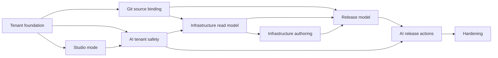

# Millblad Central Studio — implementation plan

Status: implementation plan  
Base: `cafaroo/kestra:develop`

## Goal

Deliver Central Studio incrementally while keeping the Kestra fork small, reviewable and continuously mergeable with upstream.

The implementation is intentionally split into narrow PRs following Kestra's own repository guidance: one PR, one scope.

## Delivery principles

- activate existing Kestra tenant seams instead of inventing parallel abstractions;
- preserve ordinary Kestra OSS behavior when Studio mode is disabled;
- add definition-only safety before adding infrastructure mutation;
- make AI obey the same domain/security boundaries as the UI/API;
- use Git-backed desired state for changes;
- separate authoring, applying desired state and releasing;
- add cross-tenant tests with each relevant behavior, not at the end.

## Phase 0 — fork baseline

### PR 0.1 — fork/upstream hygiene

Purpose:

- establish `upstream` tracking;
- document supported Kestra upstream baseline;
- keep Millblad patches isolated by concern.

Deliverables:

- branch/rebase policy;
- fork version marker if required;
- CI baseline for backend + UI;
- no functional changes.

Exit gate:

- clean build/test baseline on the fork.

---

## Phase 1 — real Central Studio tenancy

### PR 1.1 — `feat(tenants): add tenant registry`

Deliver:

- tenant persistence;
- immutable tenant ID;
- display name;
- `ACTIVE | DISABLED`;
- list/get/create/disable service contract;
- validation using existing `TenantIdValidator`.

Do not include:

- runtime targets;
- Forgejo config;
- environment config;
- RBAC.

Acceptance:

- `kviberg` and `acme` can coexist;
- invalid IDs are rejected;
- disabled tenant remains addressable as metadata but cannot be used as an active request context.

### PR 1.2 — `feat(tenants): resolve API tenant context`

Modify:

- `TenantService`;
- `TenantValidationFilter`;
- OSS tenant alias behavior.

Behavior:

```text
valid + active   -> resolve
invalid format   -> 400
unknown          -> 404
disabled         -> 403
```

Studio mode should fail closed for tenant-less API requests rather than silently aliasing to `main`.

Acceptance:

- existing `/api/v1/{tenant}/...` controllers operate under the real tenant;
- `resolveTenant()` returns request tenant;
- no payload parameter can override request tenant.

### PR 1.3 — `feat(tenants): make UI tenant-aware`

Deliver:

- tenant Pinia store;
- dynamic API base path;
- tenant selector in sidebar;
- explicit tenant route after initial redirect;
- safe tenant-switch navigation.

Acceptance:

- `/kviberg/flows` calls `/api/v1/kviberg/flows`;
- list route family is preserved on switch;
- entity route identity is dropped when switching customer.

### PR 1.4 — `test(tenants): enforce cross-tenant isolation`

Cover:

- flows;
- revisions;
- namespaces;
- triggers;
- execution repository boundaries where applicable to normal Kestra mode;
- internal storage;
- namespace files;
- MCP server/session tenancy;
- AI threads/messages.

Add an architectural guard that tenant-scoped Webserver APIs do not call cross-tenant repository methods such as `findAllForAllTenants()`.

Exit gate for Phase 1:

> Tenant = customer is enforced end-to-end, not a naming convention.

---

## Phase 2 — definition-only Studio mode

### PR 2.1 — `feat(system): add studio definition-only mode`

Configuration:

```yaml
millblad:
  studio:
    enabled: true
    definition-only: true
```

Deliver:

- capability/service exposing Studio mode;
- backend guard for runtime mutation/entry endpoints;
- Webserver-only Central deployment profile;
- no Worker/Scheduler/Executor/Worker Controller customer workload role.

Acceptance:

- a Central Studio instance cannot start a customer execution;
- webhook/runtime execution entrypoints are rejected;
- definitions remain editable/validatable.

### PR 2.2 — `feat(studio): add definition-only navigation`

Deliver:

- Overview;
- Infrastructure placeholder;
- Releases placeholder;
- persistent Studio indicator;
- remove runtime-data menu entries.

Blocked surfaces render a boundary explanation if reached by a stale/direct URL.

Exit gate:

> "No real customer runtime data" is visible and enforced in both API and UI.

---

## Phase 3 — AI tenancy and Studio boundary

### PR 3.1 — `fix(ai): make one-shot AI tenant-aware`

Change:

```text
/api/v1/main/ai
->
/api/v1/{tenant}/ai
```

Keep tenant resolution through `TenantService`.

Acceptance:

- flow generation works inside `kviberg`;
- no `main` fallback occurs in Studio mode.

### PR 3.2 — `feat(ai): add tool domains and availability policy`

Add:

```text
AgentToolDomain
AgentToolAvailabilityPolicy
```

Domains:

- DOCUMENTATION
- DEFINITION
- RUNTIME
- INFRASTRUCTURE
- RELEASE
- TENANT_ADMIN

Behavior:

- Studio does not advertise RUNTIME tools;
- direct dispatch of RUNTIME tools is rejected in Studio;
- normal customer runtime still has runtime tools.

### PR 3.3 — `feat(ai): add Studio route context`

Extend `ScopeBinding` and `routeScope.ts`:

- TENANT;
- INFRASTRUCTURE;
- RELEASES;
- RELEASE_TARGET.

Context contains target/node/release identifiers only.

Exit gate:

> Copilot is tenant-safe and definition-only before it gains infrastructure/release powers.

---

## Phase 4 — Git/source integration

### PR 4.1 — `feat(source): add tenant repository binding`

Add Studio metadata:

```text
tenant
repository
default branch
repository status
```

Repository binding belongs outside `TenantService`.

Acceptance:

- one tenant maps to its repository;
- another tenant cannot address that repository through tenant APIs.

### PR 4.2 — `feat(source): expose source revision metadata`

Deliver:

- current branch;
- current/desired commit;
- definition changes;
- source status used by Overview and Releases.

No release orchestration yet.

### PR 4.3 — `feat(ai): add source-aware definition tools`

Optional tools as needed:

- summarize definition changes;
- read source revision metadata;
- compare definition commits.

Keep Git writes behind explicit UI/apply operations rather than arbitrary model mutation.

Exit gate:

> Definitions have a visible, tenant-isolated source-of-truth chain.

---

## Phase 5 — infrastructure read model

### PR 5.1 — `feat(infrastructure): add desired-state model`

Introduce definitions for:

- trust boundaries;
- nodes/services;
- typed ports;
- typed edges;
- release-target membership;
- secret references.

No direct runtime mutation.

### PR 5.2 — `feat(infrastructure): add topology API`

Endpoints return:

- desired state;
- minimal observed deployment metadata;
- validation result;
- drift/diff.

Never return:

- runtime logs;
- execution payloads;
- customer files;
- secret values.

### PR 5.3 — `feat(infrastructure): add topology UI`

Build from existing Vue Flow DAG patterns:

- `InfrastructureCanvas`;
- `InfrastructureNode`;
- `TrustBoundaryGroup`;
- `NodeInspector`;
- target selector;
- read-only topology first.

### PR 5.4 — `feat(ai): add infrastructure read tools`

Tools:

- read-infrastructure;
- read-infrastructure-node;
- read-compose-definition;
- diff-infrastructure;
- validate-infrastructure.

Exit gate:

> User and AI can understand current desired/observed topology without changing it.

---

## Phase 6 — infrastructure authoring

### PR 6.1 — `feat(ai): add infrastructure draft artefact`

Extend:

```text
ArtefactKind.INFRASTRUCTURE
```

Add `author-infrastructure`.

Behavior:

- generates desired-state draft;
- validates it;
- publishes draft card;
- persists nothing automatically.

### PR 6.2 — `feat(infrastructure): apply reviewed definition changes`

Deliver:

- draft review/diff;
- apply to desired state;
- create/update Git commit;
- ChangeSetBar state.

Applying desired state is still not a production release.

### PR 6.3 — `feat(infrastructure): enable graph edit mode`

Add:

- node drag/reposition if persisted as layout metadata;
- add/remove node;
- typed connections;
- edit Compose/network/volume metadata;
- validation before apply.

Exit gate:

> Infrastructure can be authored visually or via Copilot, but production still changes only through Releases.

---

## Phase 7 — release targets and deployment

### PR 7.1 — `feat(releases): add release target model`

Target fields:

- ID/name;
- runtime URL;
- orchestrator target reference;
- desired commit;
- deployed commit;
- health;
- drift;
- status.

Target belongs to a tenant.

### PR 7.2 — `feat(releases): add release records`

Release fields:

- release ID;
- tenant;
- target;
- source SHA;
- previous SHA;
- status;
- timestamps;
- actor;
- validation result.

### PR 7.3 — `feat(releases): add release UI`

Deliver:

- target selector;
- source/deployed commit cards;
- drift;
- release history;
- promotion lane;
- Open runtime.

### PR 7.4 — `feat(releases): connect deployment orchestrator`

Lifecycle:

```text
VALIDATING
READY
APPLYING
APPLIED
FAILED
```

Runtime health is observed separately.

Exit gate:

> A specific immutable commit can be promoted to a specific isolated runtime target.

---

## Phase 8 — AI release operations

### PR 8.1 — `feat(ai): add release read tools`

- list-release-targets;
- read-release-target;
- diff-release-target;
- list-releases.

### PR 8.2 — `feat(ai): add confirmed release actions`

- create-release;
- promote-release;
- rollback-release.

All:

```text
domain = RELEASE
family = ACT
writePolicy = CONFIRM
```

Acceptance:

- no release starts before explicit approval;
- model cannot change target tenant;
- release action uses immutable commit;
- success means accepted/applied state as reported, never inferred.

Exit gate:

> Copilot can safely take Studio changes all the way to release with human confirmation.

---

## Phase 9 — hardening and operations

### PR 9.1 — security regression suite

Test:

- cross-tenant API access;
- storage isolation;
- repository binding;
- release target ownership;
- AI tool domain enforcement;
- direct tool-dispatch bypass attempts;
- disabled tenants;
- secret-value non-exposure.

### PR 9.2 — observability

Central telemetry may include:

- tenant ID;
- release ID;
- target ID;
- tool/action name;
- status/latency;
- deployment component health.

Do not centralize customer payload/log content.

### PR 9.3 — upgrade/rebase automation

Establish recurring upstream merge/rebase workflow.

Track Millblad modifications by package/scope so conflicts stay understandable.

## Dependency graph



## Suggested milestones

### M1 — Central Studio foundation

Includes Phases 1–3.

User can:

- select real customer tenants;
- browse/edit Kestra definitions;
- use tenant-safe Copilot;
- rely on a hard definition-only boundary.

### M2 — Source + topology

Includes Phases 4–5.

User can:

- see source state;
- inspect runtime topology;
- understand desired vs observed state;
- ask Copilot about infrastructure.

### M3 — authoring

Includes Phase 6.

User can:

- edit infrastructure visually;
- ask Copilot to produce infrastructure changes;
- review and commit desired-state changes.

### M4 — release control plane

Includes Phases 7–8.

User can:

- deploy immutable commits to targets;
- promote/rollback;
- drive releases via confirmed Copilot actions.

### M5 — production hardening

Includes Phase 9.

## Definition of done for the architecture

The architecture is considered implemented when all of the following hold:

- two tenants can hold identical namespace/flow IDs without collision;
- Central Studio cannot execute customer workflows;
- Central Studio contains no customer execution/log/output/secret-value data;
- every definition is attributable to tenant + Git source revision;
- every release is attributable to tenant + target + immutable commit;
- each customer runtime remains independently operable;
- Copilot tools are tenant-scoped by managed context;
- runtime AI tools cannot run in Studio;
- infrastructure authoring creates desired-state changes rather than direct production changes;
- production-impacting Copilot actions require explicit confirmation;
- cross-tenant isolation is covered by automated tests.
