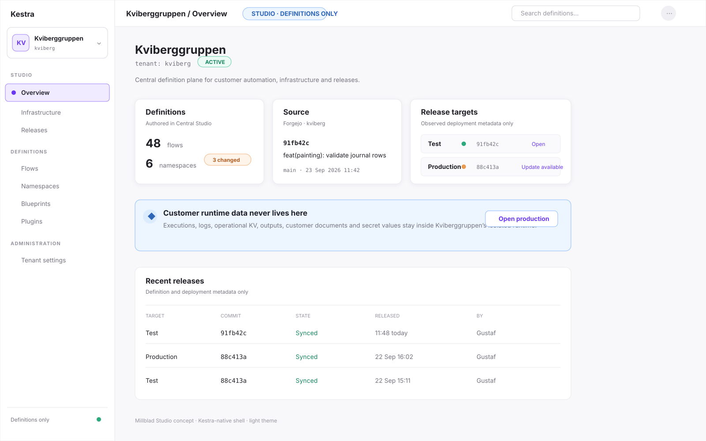
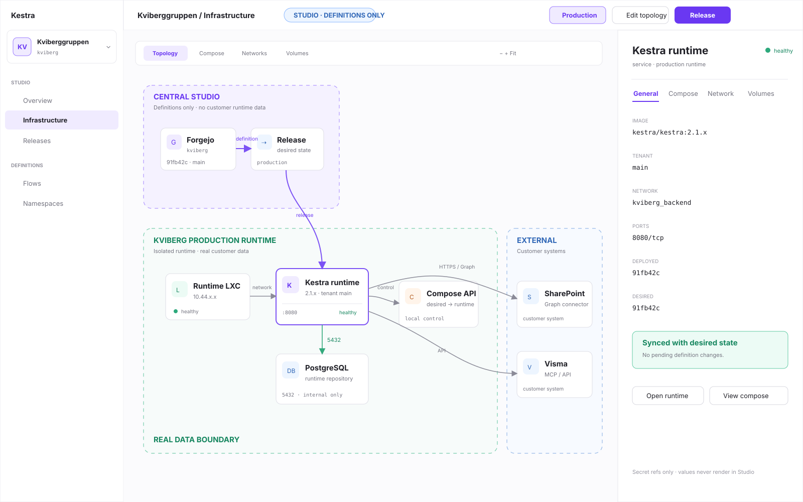
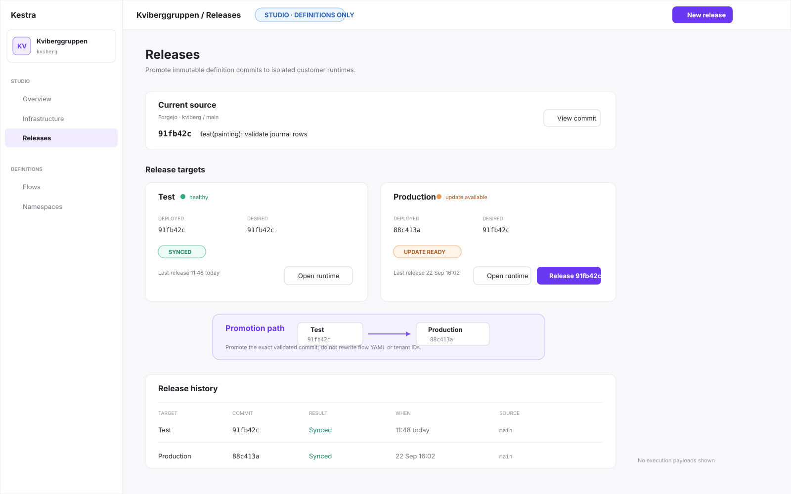

# Millblad Central Studio — UI design

Status: design specification  
Target: `cafaroo/kestra` fork, based on Kestra OSS `develop` / 2.1.x  
Scope: tenant-aware Central Studio, definition-only safety boundary, infrastructure and release UX

## Product invariant

Central Studio is a definition and control plane. It must not become a customer runtime.

```text
Central Studio
  customer = tenant
  no customer runtime data
       |
       | definitions / immutable releases
       v
Forgejo
       |
======= trust + data boundary =======
       |
       v
Customer runtime
  single-tenant Kestra OSS
  tenant = main
  real customer data
```

The UI must make that distinction visible everywhere without turning Kestra into a visually separate product.

## Design direction

The design extends Kestra rather than reskinning it:

- existing `KsSideBar` remains the primary navigation shell;
- existing `KsTopNavBar` remains the page header;
- existing `KsCard`, `KsTag`, `KsTabs`, `KsDataTable`, `KsSplitter`, `KsDrawer` and `KsAlert` provide the base vocabulary;
- the existing Vue Flow DAG implementation under `ui/src/components/dependencies/components/dag/` becomes the technical foundation for the Infrastructure canvas;
- all implementation styling uses existing `--ks-*` tokens and supports both Kestra light and dark themes;
- no new visual identity is introduced for Millblad Studio.

## New information architecture

Inside Central Studio the active tenant is the first scope.

```text
Kviberggruppen (tenant)
├── Overview
├── Infrastructure
├── Releases
│
├── Definitions
│   ├── Flows
│   ├── Namespaces
│   ├── Blueprints
│   └── Plugins
│
└── Administration
    └── Tenant settings
```

The following runtime surfaces are hidden in definition-only Studio mode:

- Executions
- Logs
- runtime KV
- execution outputs and files
- customer secret values

The UI may show runtime metadata such as endpoint, health, deployed commit, release target and drift state. It must not proxy customer operational data into the central instance.

## Core screens

### 1. Tenant overview



The overview answers four questions:

1. Which customer am I working in?
2. What definitions are currently authored?
3. Which commit is the source of truth?
4. What is deployed to each release target?

There are deliberately no execution charts, log summaries or customer data metrics.

### 2. Infrastructure



Infrastructure is a graph editor and inspector, not another table.

The canvas uses three semantic zones:

- **Central Studio** — definition metadata only;
- **Tenant runtime** — customer-isolated runtime;
- **External systems** — SharePoint, Visma, Graph, customer APIs, etc.

Nodes represent managed resources such as runtime, Kestra, PostgreSQL, container/compose services and external integrations. Clicking a node keeps the canvas visible and opens a persistent inspector in the right splitter panel.

### 3. Releases



Release targets are not tenants. A tenant can have several targets, each pointing at a separate runtime instance and immutable Git commit.

The release page focuses on:

- source commit;
- target commit;
- health;
- drift;
- promotion;
- release history.

It does not expose execution data.

## Persistent tenant context

The tenant switcher lives in the sidebar header because tenant is a global scope, not a per-page filter.

Expanded:

```text
┌─────────────────────────────┐
│ KV  Kviberggruppen       ▾  │
│     kviberg                 │
└─────────────────────────────┘
```

Collapsed:

```text
┌────┐
│ KV │
└────┘
```

Switching tenant rewrites the route tenant parameter. The application should preserve the current route family where safe, but never carry entity IDs across tenants.

Examples:

- `/kviberg/flows` → `/acme/flows`
- `/kviberg/infrastructure` → `/acme/infrastructure`
- `/kviberg/flows/painting.ata/calculate` → `/acme/flows`, not the same flow ID

## Definition-only indicator

A compact, persistent Studio indicator is shown in the top navigation:

```text
[ STUDIO · DEFINITIONS ONLY ]
```

It is informational, not a warning. On pages where a user might expect runtime data, a stronger `KsAlert` explains that operational data remains in the customer runtime and offers **Open runtime**.

## Design references in the Kestra codebase

| Need | Existing Kestra primitive / pattern |
| --- | --- |
| Application navigation | `KsSideBar`, `ui/src/components/layout/SideBar.vue` |
| Global page header | `KsTopNavBar`, `AppTopNavBar.vue` |
| Page cards | `KsCard` |
| Status and scope labels | `KsTag`, `KsBadge` |
| Environment/view switching | `KsTabs type="segmented"` |
| Canvas + details | `KsSplitter` |
| Graph interactions | existing Vue Flow `DagCanvas.vue` |
| Node visual language | existing `AssetNode.vue` |
| Temporary create/edit forms | `KsDrawer` |
| Lists and history | `KsDataTable` |
| Visual tokens | `ks-tokens.scss` + theme files |

## Documents

- [Design primitives](DESIGN_PRIMITIVES.md)
- [UX and routes](UX_AND_ROUTES.md)
- [Implementation map](IMPLEMENTATION_MAP.md)
- [AI integration](AI_INTEGRATION.md)

## Non-goals

This design does not add customer-facing IAM/RBAC, proxy runtime data, model environments as tenants, or introduce a parallel Millblad component library.
