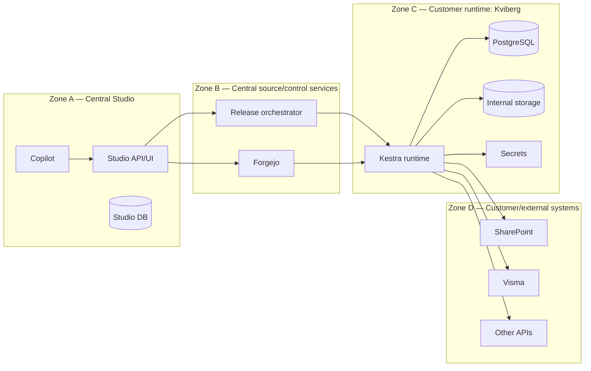

# Millblad Central Studio — security and data boundaries

Status: security architecture  
Primary invariant: Central Studio contains definition/control data, not customer runtime payload data.

## 1. Trust zones



A connection does not imply unrestricted data flow. The allowed data classes below are authoritative.

## 2. Data classes

### D0 — public/product metadata

Examples:

- Kestra documentation;
- plugin schemas;
- product/version information.

Allowed centrally: yes.

### D1 — Studio definition metadata

Examples:

- tenant ID/name;
- namespace names;
- flow YAML;
- infrastructure desired state;
- source commit IDs;
- release target metadata;
- secret references.

Allowed centrally: yes.

### D2 — deployment observation metadata

Examples:

- deployed commit;
- service/component health;
- runtime endpoint;
- release status;
- version/image metadata.

Allowed centrally: yes, minimized.

### D3 — customer operational metadata

Examples:

- execution IDs;
- execution states;
- runtime log metadata;
- runtime KV names;
- customer document metadata.

Allowed centrally: **no by default**.

If a future feature requires a specific D3 field, it must be introduced through an explicit architecture/security decision rather than expanding the boundary implicitly.

### D4 — customer payload/sensitive runtime data

Examples:

- execution inputs/outputs;
- logs containing customer content;
- SharePoint documents;
- invoice/customer records;
- runtime KV values;
- secret values;
- credentials/tokens.

Allowed centrally: **no**.

## 3. Allowed flows

| From | To | Data |
| --- | --- | --- |
| Studio | Forgejo | D1 definitions |
| Forgejo | Runtime | D1 immutable definitions |
| Studio | Orchestrator | D1 release intent + D2 target identifiers |
| Orchestrator | Runtime | deployment/control requests |
| Runtime | Orchestrator/Studio | D2 acknowledgement/health/drift |
| Runtime | Customer systems | D3/D4 required by workflow |
| User | Copilot | user-authored prompt; should avoid D4 |
| Copilot tools | Studio services | D0/D1/D2 within tenant |

## 4. Forbidden flows

- Runtime execution logs → Central Studio.
- Runtime customer documents → Central Studio.
- Secret values → Central Studio.
- Cross-tenant flow/storage/repository reads.
- AI model argument → tenant selection.
- AI infrastructure draft → direct production mutation.
- Release action → runtime without confirmation where initiated by AI.
- Customer runtime → another customer runtime through Central Studio.

## 5. Tenant enforcement layers

Tenant isolation must exist at several layers.

### Routing

```text
/api/v1/{tenant}/...
```

Request tenant is validated before controller execution.

### Service context

`TenantService.resolveTenant()` is the canonical request tenant.

### Repository

Every tenant-scoped query includes `tenant_id`.

### Storage

Storage calls include tenant and map to tenant-specific physical/logical paths.

### Git/source

Tenant repository binding prevents one tenant's source operations from addressing another tenant repository.

### Release targets

Every target is owned by exactly one tenant.

### AI

AI tools receive tenant from `AgentCallContext`, not model arguments.

## 6. Studio definition-only enforcement

Definition-only mode must be authoritative server-side.

UI hiding alone is insufficient.

Required controls:

1. do not deploy Worker/Scheduler/Executor customer workload roles centrally;
2. block execution-start APIs;
3. block webhook/runtime execution entrypoints;
4. mark runtime AI tools unavailable;
5. omit runtime-data navigation;
6. prevent runtime payload ingestion APIs in Studio features.

## 7. Secrets

Central Studio may store or version **references**, such as:

```text
secretRef: kviberg/prod/sharepoint-client
```

It must not display or persist the resolved value.

Resolution happens inside the runtime/control boundary designed for that secret backend.

AI tool results must redact/omit resolved secret values even if underlying APIs accidentally provide them.

## 8. AI threat model

### Cross-tenant prompt/tool injection

Risk:

A user/model asks a tool to access `acme` while the thread is `kviberg`.

Mitigation:

- tenant not present in tool schema;
- tool uses managed `AgentCallContext.tenant`;
- repositories still enforce tenant filters.

### Runtime-data extraction

Risk:

Copilot asks execution/log tools centrally.

Mitigation:

- runtime tool domain unavailable in Studio;
- authoritative dispatch-time rejection;
- no runtime data source connected to those tools centrally.

### Unconfirmed production change

Risk:

Model calls release/deployment action.

Mitigation:

- release action = `ACT + CONFIRM`;
- orchestrator persists pending action;
- explicit human approval required.

### Prompt-carried sensitive data

Risk:

Human manually pastes customer secret/payload into Copilot.

Mitigation roadmap:

- UI guidance;
- secret-pattern detection/redaction;
- retention policy;
- provider data-handling configuration.

This is separate from automatic system data access.

## 9. Release security

A release request must bind:

```text
tenant
target
source commit SHA
actor
validation result
```

The server re-resolves target ownership and commit existence.

Never trust browser-supplied:

- target tenant ownership;
- deployed state;
- commit validity;
- diff summary.

Those are re-read server-side before creating the release.

## 10. Failure behavior

Security-relevant failures fail closed.

Examples:

```text
unknown tenant        -> reject
disabled tenant       -> reject
unknown target        -> reject
target wrong tenant   -> reject
unavailable tool      -> reject
missing source commit -> reject
secret value request  -> reject/redact
runtime API in Studio -> reject
```

Do not silently fall back to `main` in Central Studio.

## 11. Logging and observability

Central logs may record:

- tenant ID;
- route/action;
- source SHA;
- release ID;
- target ID;
- AI tool name;
- status/error class.

Do not include:

- secrets;
- raw customer documents;
- execution input/output payloads;
- customer runtime logs.

## 12. Security test matrix

| Boundary | Required regression |
| --- | --- |
| API tenancy | tenant A cannot fetch tenant B resource |
| Repository | identical IDs remain isolated |
| Storage | no cross-tenant read/list/exists |
| Git binding | tenant A cannot address tenant B repo |
| Release target | target ownership checked server-side |
| AI context | tenant not model-controlled |
| AI availability | runtime tool rejected in Studio |
| AI confirmation | release cannot execute before approval |
| Secrets | values never returned/rendered centrally |
| Studio mode | execution APIs blocked |

## 13. Security review triggers

Require explicit architecture/security review before:

- centralizing any execution/log/customer document data;
- adding cross-tenant searches;
- exposing a runtime database directly to Central Studio;
- giving Copilot generic shell/SSH access to customer runtimes;
- allowing an AI tool to select tenant;
- allowing an AI action to bypass confirmation for deployment;
- storing resolved credentials centrally.
